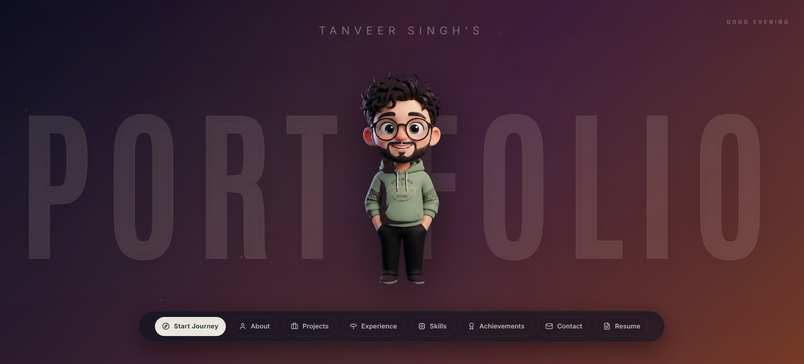

# 🌌 Tanverse Portfolio OS v2.0.0



A professional, high-end developer portfolio designed as an interactive desktop environment. Built with an editorial aesthetic, dynamic micro-interactions, hardware-accelerated animations, and responsive theme adaptation.

---

## 🎨 Design Philosophy & Aesthetics
* **Midnight Glass vs. Warm Editorial Matte Linen**: Seamlessly adapts between a deep midnight charcoal theme (`#060913`) and a low-glare, warm concrete paper theme (`#E6E3D8`) using a vector-morphing celestial toggle.
* **Futuristic Custom Cursor**: A custom GSAP-engineered pointer reticle that calculates motion velocity, applies physics-based tilt rotation, and manages a lagging double-layered ghost trail.
* **Atmospheric Physics**: Features a responsive particle connection web in the hero background, reacting dynamically to cursor placement and movement.
* **Tactile Sounds**: Real-time sound feedback using Web Audio synth nodes to output high-fidelity pops, clicks, success chime arpeggios, and error frequencies.

---

## 🛠️ The Tech Stack

| Layer | Technology | Purpose |
| :--- | :--- | :--- |
| **Core Framework** | **React 19** | Dynamic view declarations, custom context state pipelines, and ref-based DOM bindings. |
| **Language** | **TypeScript** | Strict compile-time typing, interface contracts, and module safety. |
| **Build Engine** | **Vite** | Lightning-fast HMR server, bundle chunk optimization, and asset compilation. |
| **Styling** | **Tailwind CSS** | Editorial layouts, utility overrides, and adaptive variables mapping. |
| **Physics / Scroll** | **Lenis Scroll** | Inertial momentum-based scrolling physics for buttery-smooth page glides. |
| **State Management** | **Zustand** | Central store for cursor, sound configurations, navigation, and visitor telemetry. |
| **Animations** | **Framer Motion** | Staggered springs, entrance overlays, and SVG morphing celestial vectors. |
| **Audio Processing** | **Web Audio API** | Hardware-primed `AudioContext` engines producing synthetic sound effects. |

---

## 🚀 Key Architectural Features

### ⚡ Performance Optimization
* **Ref-Based Cursor Acceleration**: Cursor coordinate tracking writes directly to React refs, triggering raw CSS transform writes via `requestAnimationFrame`. This bypasses React re-renders completely on mouse movement, locking the frame rate to a smooth 120fps.
* **Canvas Viewport Throttling**: The particle background utilizes an `IntersectionObserver`. When scrolled out of view, the particle animation loop is completely frozen, dropping CPU/GPU usage to `0%`.
* **Hardware Wake-Up Cues**: Clicks use an extended `80ms` decay envelope to bypass power-saving wake-up latency common in modern external audio cards and drivers.

### 📋 Interactive Portfolio Modules
1. **Interactive Navigation Dock**: Retro-futuristic dark glass dock loading and jumping to coordinates.
2. **About Me Registry**: Clean grid layout highlighting educational milestones and tech parameters.
3. **Modernized Experience timeline**: Always-expanded grid detailing company profiles, technical metrics, achievements, and tech stacks.
4. **Holographic Skill Deck**: Interactive category stack showing average proficiency rings and ruler-style progress sliders with cursor spotlight halos.
5. **Milestone Achievements**: spotlight cards categorizing national hackathon wins, competitive coding profiles, and accolades.
6. **Featured Projects**: Custom slider displaying horizontal cards and deep-linking into detailed project pages.
7. **Leadership & Credentials**: Side-by-side dual columns displaying positions of responsibility (TnP, Cinematics, Class Representative) and professional simulation badges (Quantium, Deloitte, Siemens).
8. **Print-Optimized CV Sheet**: A scroll-wrapped container for screen efficiency that dynamically expands to a clean, formatted single-page resume sheet under print commands (`Ctrl + P` / Save PDF).
9. **Operational Telemetry**: Features a live ticking Delhi, IN (IST) clock and a ticking session uptime tracker inside the telemetry console footer.

---

## 🛠️ Installation & Setup

1. **Clone the repository**:
   ```bash
   git clone https://github.com/tanveersingh005/Tanverse.git
   cd Tanverse
   ```

2. **Install dependencies**:
   ```bash
   npm install
   ```

3. **Start the local development server**:
   ```bash
   npm run dev
   ```

4. **Build for production compilation**:
   ```bash
   npm run build
   ```

5. **Preview production bundle locally**:
   ```bash
   npm run preview
   ```

---

## 📄 License & Compliance
Designed and compiled by **Tanveer Singh**. Compliance with modern design standards.
All rights reserved © 2026.
